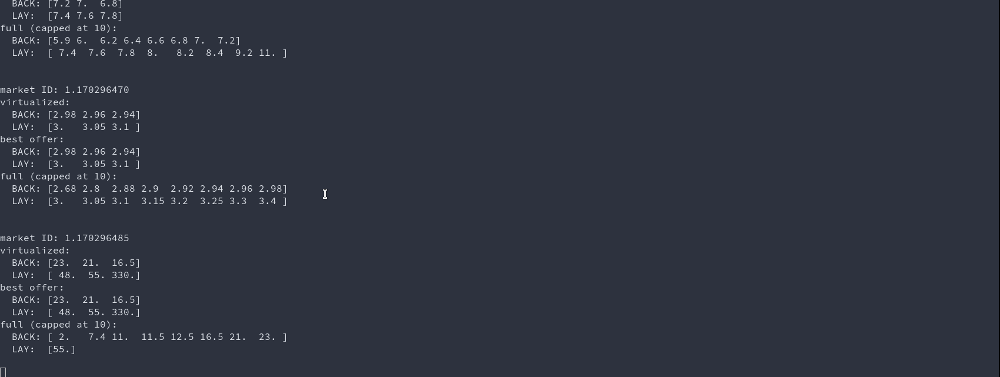

# Betfairstreamer

What this library provides

* Run single or multiple streams simultaneously (single threaded)
* Market cache and order cache, these provide abstractions over the betfairstream
* Using numpy arrays to slicing markets selections.
* Async streaming (Optional)
* Parse historical data (Example below)

## Installation

```
pip install betfairstreamer
```
## Demo


## Tutorial
#### Credentials
Create a credential file credentials.env
with following content.
```
USERNAME=BETFAIR_USERNAME
PASSWORD=BETFAIR_PASSWORD
APP_KEY=BETFAIR_APP_KEY
LOCALE=IFANY
CERT_PATH=PATH_TO_BETFAIR_CERTIFICATES
```
#### Virtual environment
Create a virtual environment, needs python >= 3.8.0
```shell script
python3.8 -m venv venv
source venv/bin/activate
pip install betfairstreamer==0.5.3
```

#### Create Application
main.py
```python
import logging
import time

import numpy as np
import orjson

from betfairstreamer.models import BetfairMarketFilter, BetfairMarketDataFilter
from betfairstreamer.cache import MarketCache, OrderCache
from betfairstreamer.stream.stream import create_connection_pool
from betfairstreamer.utils import create_market_subscription, create_order_subscription

np.set_printoptions(precision=3)

logging.basicConfig(level=logging.INFO)

horses_subscription_message = create_market_subscription(
    # Asian Handicap is not yet supported if using EX_ALL_OFFER.
    market_filter=BetfairMarketFilter(eventTypeIds=["7"], marketTypes=["WIN"]),
    market_data_filter=BetfairMarketDataFilter(
        ladderLevels=3,  # Ladder levels are fixed to 3 at the moment.
        fields=[
            "EX_MARKET_DEF",
            "EX_BEST_OFFERS",
            "EX_LTP",
            "EX_BEST_OFFERS_DISP",
            "EX_ALL_OFFERS",
        ],
    ),
    conflate_ms=1000 # Remove this if you want full speed ...
)

order_subscription_message = create_order_subscription()

market_cache = MarketCache()
order_cache = OrderCache()

connection_pool = create_connection_pool([horses_subscription_message, order_subscription_message])

for update in connection_pool.read():
    update = orjson.loads(update)

    market_updates = market_cache(update)
    order_updates = order_cache(update)

    for market_book in market_updates:
        # From full price ladder take sortPriority one, select ladder levels having a size greater or equal to 2.0.
        maskB = market_book.full_price_ladder[0, 0, :, 1] >= 2.0
        maskL = market_book.full_price_ladder[0, 1, :, 1] >= 2.0
        # Marketbook price size index: [SortPriority, LAY/BACK, LadderLevel, Price/Size]
        print()
        print(f"market ID: {market_book.market_id}\n"
              f"virtualized:\n"
              f"  BACK: {str(market_book.best_display[0, 0, :, 0])}\n"
              f"  LAY:  {str(market_book.best_display[0, 1, :, 0])}\n"
              f"best offer:\n"
              f"  BACK: {str(market_book.best_offers[0, 0, :, 0])}\n"
              f"  LAY:  {str(market_book.best_offers[0, 1, :, 0])}\n"
              f"full (capped at 8):\n"
              f"  BACK: {str(market_book.full_price_ladder[0, 0, maskB, 0][-8:])}\n"
              f"  LAY:  {str(market_book.full_price_ladder[0, 1, maskL, 0][:8])}\n"
              )

    for order in order_updates:
        print(order)


```

#### Run

```
env $(cat credentials.env) python main.py
```


## Read historical data
```python
import bz2 # If you download data from betfair

market_cache = MarketCache()

# market_updates = open("market_file", "r").readlines() # If files are not compressed
# market_updates = bz2.open("market_file.bz2", "r").readlines()  # If files are compressed

for market_update in market_updates:
    market_books = market_cache(orjson.loads(market_update))    

    for market_book in market_books: 
        # Do something with market_book...

```

## Benchmark
```Benchmark
Setup: Two processes, one sending betfair stream messages , one receiving.

Hardware: I7 8550U, 16GB ram

Results: 
 * Using a market cache it can read around 25k messages/second
 * Without market cache >> 100 Mb/s

```

       
